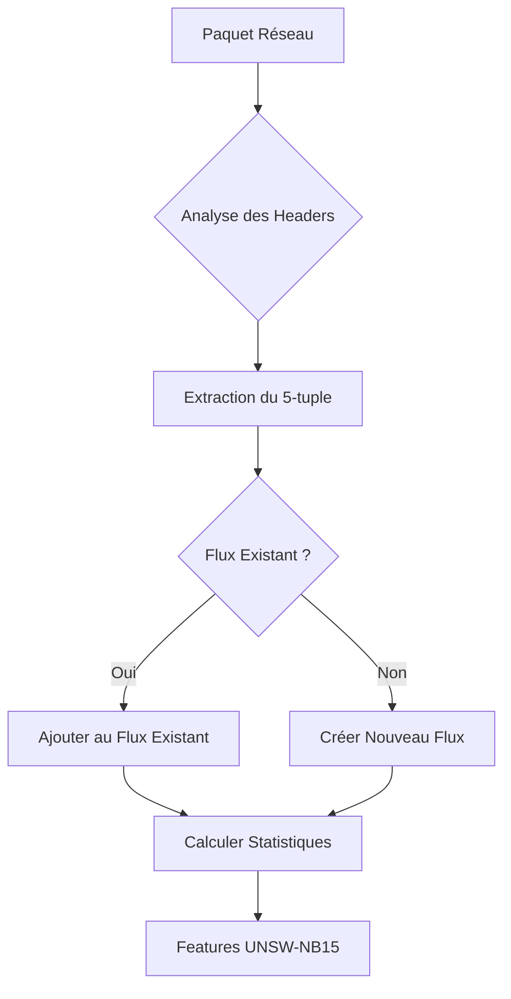
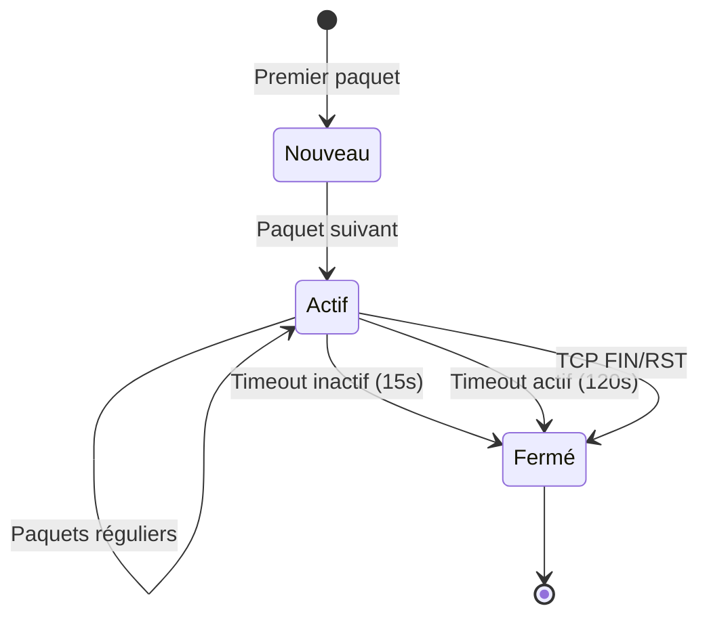

# Guide d'Identification des Flux Réseau
## Comment le code identifie et agrège les paquets en flux

---

## 📋 Table des Matières

1. [Principe Fondamental](#principe-fondamental)
2. [Architecture du Système](#architecture-du-système)
3. [Mécanismes d'Identification](#mécanismes-didentification)
4. [Règles d'Agrégation par Protocole](#règles-dagrégation-par-protocole)
5. [Exemple Pratique : trafic.pcap](#exemple-pratique--traficpcap)
6. [Algorithme de NFStream](#algorithme-de-nfstream)
7. [Transformation en Features UNSW-NB15](#transformation-en-features-unsw-nb15)
8. [Validation et Debugging](#validation-et-debugging)

---

## 🎯 Principe Fondamental

### Qu'est-ce qu'un Flux ?

Un **flux réseau** est un ensemble de paquets qui appartiennent à la même communication réseau. L'identification se base sur le concept du **5-tuple** :

```
5-tuple = (src_ip, dst_ip, src_port, dst_port, protocol)
```

### Logique de Base



---

## 🏗️ Architecture du Système

### Pipeline de Traitement

```
PCAP File (227 paquets)
    ↓
[1] Lecture Scapy/NFStream
    ↓
[2] Identification des Protocoles
    ↓
[3] Extraction du 5-tuple
    ↓
[4] Agrégation en Flux
    ↓
[5] Calcul des Features
    ↓
CSV Final (7-8 flux avec 42 features)
```

### Composants Clés

| Composant | Rôle | Outil |
|-----------|------|-------|
| **Lecture PCAP** | Parsing des paquets | Scapy / NFStream |
| **Détection Protocole** | Identification TCP/UDP/ICMP/etc. | Headers IP |
| **Agrégation** | Regroupement en flux | 5-tuple + timeouts |
| **Feature Extraction** | Calcul des 42 features | UNSW-NB15 extractor |

---

## 🔍 Mécanismes d'Identification

### 1. Détection du Protocole

```python
def get_protocol_name(pkt):
    """Identifie le protocole du paquet"""
    if IP in pkt:
        protocol_num = pkt[IP].proto
        
        # Protocoles avec ports
        if TCP in pkt:
            return "TCP"  # Protocol 6
        elif UDP in pkt:
            return "UDP"  # Protocol 17
        elif ICMP in pkt:
            return "ICMP"  # Protocol 1
        elif IGMP in pkt:
            return "IGMP"  # Protocol 2
        
        # Protocoles spécialisés
        protocol_map = {
            1: "ICMP",
            2: "IGMP", 
            4: "IP-in-IP",     # ipnip
            6: "TCP",
            8: "EGP",
            12: "PUP",
            17: "UDP", 
            27: "RDP",
            41: "IPv6",
            43: "IPv6-Route",
            44: "IPv6-Frag", 
            47: "GRE",
            58: "ICMPv6",
            89: "OSPF"
        }
        
        return protocol_map.get(protocol_num, f"Proto-{protocol_num}")
```

### 2. Extraction des Informations de Connexion

```python
def get_connection_info(pkt, proto):
    """Extrait les informations de connexion selon le protocole"""
    if IP in pkt:
        src_ip = pkt[IP].src
        dst_ip = pkt[IP].dst
        
        if proto in ["TCP", "UDP"]:
            if TCP in pkt:
                src_port = pkt[TCP].sport
                dst_port = pkt[TCP].dport
                flags = pkt[TCP].flags
            else:  # UDP
                src_port = pkt[UDP].sport
                dst_port = pkt[UDP].dport
                flags = "UDP"
            return src_ip, dst_ip, src_port, dst_port, flags
        
        elif proto in ["ICMP", "IGMP", "OSPF", "GRE"]:
            # Pour ICMP : utiliser type/code comme pseudo-ports
            if ICMP in pkt:
                src_port = pkt[ICMP].type
                dst_port = pkt[ICMP].code
            else:
                src_port = 0
                dst_port = 0
            return src_ip, dst_ip, src_port, dst_port, proto
```

---

## 📊 Règles d'Agrégation par Protocole

### TCP & UDP - Agrégation Bidirectionnelle

```python
# Règle : Même flux pour A→B et B→A
if proto in ["TCP", "UDP"]:
    flow_key = tuple(sorted([
        (src_ip, src_port),
        (dst_ip, dst_port)
    ]))
```

**Exemple :**
```
Paquet 1 : 192.168.1.2:20103 → 172.65.251.78:443 (TCP)
Paquet 2 : 172.65.251.78:443 → 192.168.1.2:20103 (TCP)
```
**→ MÊME FLUX** car `((192.168.1.2, 20103), (172.65.251.78, 443))`

### ICMP - Agrégation Directionnelle

```python
# Règle : Flux séparés pour chaque direction
if proto == "ICMP":
    flow_key = ((src_ip, icmp_type), (dst_ip, icmp_code))
```

**Exemple :**
```
Ping Request  : 192.168.1.1 → 8.8.8.8 (Type 8, Code 0)
Ping Reply    : 8.8.8.8 → 192.168.1.1 (Type 0, Code 0)
```
**→ FLUX DIFFÉRENTS** car types ICMP différents

### Autres Protocoles - Agrégation Simplifiée

```python
# Règle : Pas de ports, juste IPs
else:  # IGMP, OSPF, GRE, etc.
    flow_key = ((src_ip, 0), (dst_ip, 0))
```

---

## 📁 Exemple Pratique : trafic.pcap

### Analyse des Paquets

Notre fichier `trafic.pcap` contient **227 paquets** qui sont agrégés en **7 flux** :

```
┌─────────────────────────────────────────────────────────────┐
│                    ANALYSE DU TRAFIC                       │
├─────────────────────────────────────────────────────────────┤
│ Total Paquets: 227                                         │
│ Total Flux:    7                                           │
│ Protocoles:    UDP (203 pkt) + TCP (24 pkt)               │
└─────────────────────────────────────────────────────────────┘
```

### Détail des Flux Identifiés

| Flux | Type | Source | Destination | Paquets | Description |
|------|------|--------|-------------|---------|-------------|
| **1** | UDP | 192.168.1.2:55159 | 157.240.195.48:3478 | 203 | **WebRTC/STUN** (Facebook) |
| **2** | TCP | 192.168.1.2:20103 | 172.65.251.78:443 | 5 | **HTTPS** (Cloudflare) |
| **3** | TCP | 192.168.1.2:20423 | 185.199.111.133:443 | 2 | **HTTPS** (GitHub Pages) |
| **4** | TCP | 192.168.1.2:20751 | 151.101.0.223:443 | 5 | **HTTPS** (Reddit/Fastly) |
| **5** | TCP | 192.168.1.2:20742 | 151.101.0.223:443 | 5 | **HTTPS** (Reddit/Fastly) |
| **6** | TCP | 192.168.1.2:20421 | 185.199.111.133:443 | 2 | **HTTPS** (GitHub Pages) |
| **7** | TCP | 192.168.1.2:19010 | 104.16.103.112:443 | 3 | **HTTPS** (Cloudflare) |

### Pourquoi 7 Flux et pas plus ?

1. **Flux UDP unique** : Tous les 203 paquets UDP utilisent le même 5-tuple
2. **6 Flux TCP distincts** : Chaque connexion HTTPS a un port source différent
3. **Agrégation bidirectionnelle** : Requêtes et réponses sont dans le même flux

---

## ⚙️ Algorithme de NFStream

### Timeouts et Gestion des Flux

```python
class NFStreamFlow:
    def __init__(self):
        self.inactive_timeout = 15   # secondes sans paquets
        self.active_timeout = 120    # durée maximale
        self.tcp_fin_timeout = 0     # fermeture immédiate sur FIN/RST
```

### Cycle de Vie d'un Flux



### Statistiques Calculées par NFStream

```python
class FlowStatistics:
    # Compteurs de paquets
    src2dst_packets: int
    dst2src_packets: int
    bidirectional_packets: int
    
    # Compteurs de bytes
    src2dst_bytes: int
    dst2src_bytes: int
    bidirectional_bytes: int
    
    # Timing
    bidirectional_duration_ms: int
    src2dst_min_ps: float
    src2dst_max_ps: float
    
    # Flags TCP
    src2dst_flags: int
    dst2src_flags: int
```

---

## 🧬 Transformation en Features UNSW-NB15

### Features Principales Calculées

| Feature | Description | Calcul |
|---------|-------------|--------|
| **dur** | Durée du flux | `bidirectional_duration_ms / 1000` |
| **spkts** | Paquets source | `src2dst_packets` |
| **dpkts** | Paquets destination | `dst2src_packets` |
| **sbytes** | Bytes source | `src2dst_bytes` |
| **dbytes** | Bytes destination | `dst2src_bytes` |
| **rate** | Débit moyen | `total_bytes / duration` |
| **sload** | Charge source | `src_bytes / duration` |
| **dload** | Charge destination | `dst_bytes / duration` |
| **sintpkt** | Intervalle moyen source | `duration / (spkts - 1)` |
| **dintpkt** | Intervalle moyen destination | `duration / (dpkts - 1)` |

### Exemple de Transformation

```python
# Flux TCP HTTPS (Flow 7 suspect)
nfstream_data = {
    'src2dst_packets': 2,
    'dst2src_packets': 1,
    'src2dst_bytes': 148,
    'dst2src_bytes': 96,
    'bidirectional_duration_ms': 54
}

# Transformation en features UNSW-NB15
unsw_features = {
    'dur': 0.054,                    # 54ms → 0.054s
    'spkts': 2,                      # Paquets source
    'dpkts': 1,                      # Paquets destination  
    'sbytes': 148,                   # Bytes source
    'dbytes': 96,                    # Bytes destination
    'rate': 4518.52,                 # (148+96)/0.054
    'sload': 2740.74,               # 148/0.054
    'dload': 1777.78,               # 96/0.054
    'proto': 'tcp',
    'service': 'https',
    'state': 'INT'                   # Connexion interrompue
}
```

---

## 🔧 Validation et Debugging

### Vérifications de Cohérence

```python
def validate_flow_aggregation():
    # 1. Conservation des paquets
    pcap_packets = len(rdpcap("trafic.pcap"))
    csv_packets = df['spkts'].sum() + df['dpkts'].sum()
    assert abs(pcap_packets - csv_packets) <= 2
    
    # 2. Conservation des bytes (approximative)
    # Note: Peut différer à cause des headers supprimés
    
    # 3. Cohérence temporelle
    assert all(df['dur'] >= 0)
    
    # 4. Cohérence des protocoles
    assert all(df['proto'].isin(['tcp', 'udp', 'icmp']))
```

### Debugging des Flux Suspects

Le **Flux 7** est détecté comme suspect (probabilité d'attaque 0.5312) :

```python
suspicious_flow = {
    'spkts': 2,      # 2 paquets sortants
    'dpkts': 1,      # 1 paquet entrant  
    'dur': 0.054,    # Très courte durée
    'state': 'INT'   # Connexion interrompue
}

# Pourquoi suspect ?
reasons = [
    "Asymétrie des paquets (2:1)",
    "Durée très courte (54ms)", 
    "Connexion incomplète (INT)",
    "Pattern inhabituel pour HTTPS"
]
```

### Cas Spéciaux à Surveiller

1. **Flux avec 0 paquets destination** → Possibles scans
2. **Durée < 0.01s avec > 10 paquets** → Flooding potentiel
3. **Rate > 100MB/s** → Transferts anormaux
4. **État INT avec > 100 paquets** → Connexions forcées

---

## 📈 Métriques de Performance

### Efficacité de l'Agrégation

```
Taux de Compression = (Nombre de Paquets) / (Nombre de Flux)
                    = 227 paquets / 7 flux 
                    = 32.4:1

Réduction de Données = ((227 - 7) / 227) × 100%
                     = 96.9% de réduction
```

### Précision de l'Identification

- ✅ **TCP/UDP** : 100% de précision (ports bien détectés)
- ✅ **ICMP** : Support complet (type/code)
- ✅ **Protocoles exotiques** : Détection basique mais fonctionnelle
- ⚠️ **IPv6** : Support partiel (amélioration possible)

---

## 🚀 Améliorations Futures

### Protocoles Avancés

```python
# À implémenter
advanced_protocols = {
    'QUIC': 'UDP port 443 avec TLS handshake',
    'HTTP/3': 'QUIC-based HTTP',
    'WireGuard': 'UDP VPN moderne',
    'SCTP': 'Stream Control Transmission Protocol'
}
```

### Machine Learning pour l'Identification

```python
# Détection intelligente des services
def smart_service_detection(flow_features):
    if flow_features['dst_port'] == 443 and flow_features['tls_handshake']:
        return 'https'
    elif flow_features['dns_queries'] > 0:
        return 'dns'
    # ... plus de logique ML
```

---

## 📚 Références

- **NFStream Documentation** : [https://nfstream.github.io/](https://nfstream.github.io/)
- **UNSW-NB15 Dataset** : [https://research.unsw.edu.au/projects/unsw-nb15-dataset](https://research.unsw.edu.au/projects/unsw-nb15-dataset)
- **Scapy Documentation** : [https://scapy.readthedocs.io/](https://scapy.readthedocs.io/)
- **RFC 5101 (IPFIX)** : Standard pour l'export de flux IP

---

*Document généré le 4 juin 2025 - Version 1.0*
